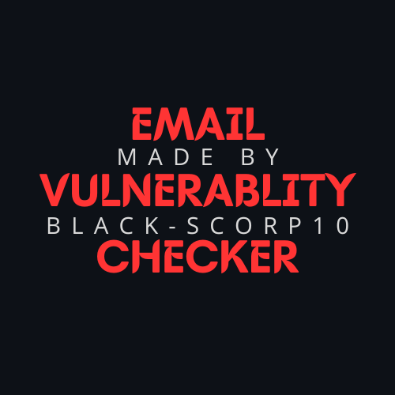
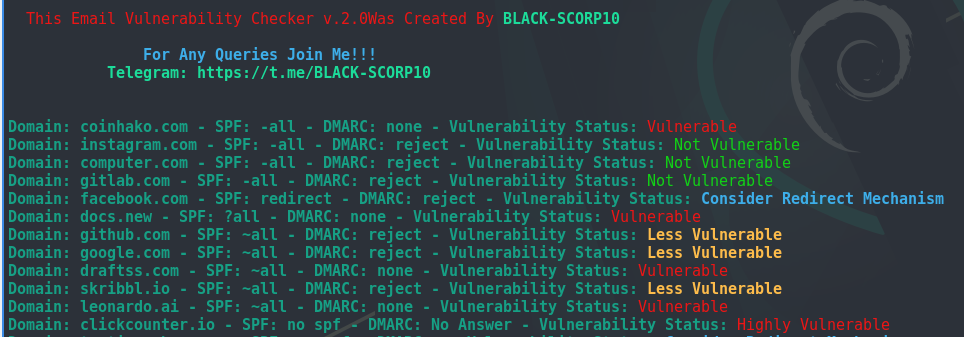

<h1 align="center">
   
  
   
  Email Vulnerablity Checker v2.0
   
</h1>

Verify whether the domain is vulnerable to spoofing by Email-vulnerablity-checker

## Features of Version 2.0

- Added Support to save output on a file using -o flag
- Added more checks that will accurately tell you the Vulnerability Status.
- Updated the code completely with proper and accurate results.
- Enhanced the tool and decorated some look and feel on the tool.

Email Vulnerability Checker

This script checks the SPF and DMARC configurations of email domains to determine their vulnerability status. It's useful for system administrators or security professionals to assess email infrastructure security.

## Usage

To run the script, execute it with the following command:

./spfvuln.sh [options]

### Options

- -h, --help: Display the help message.
- -v: Display the version of the script.
- -t <file>: Specify a file containing a list of domains to check.
- -d <domain>: Specify a single domain to check.
- -o <output.txt>: Specify an output file to save the results.

## Requirements

- Bash-compatible shell: Ensure your system supports Bash scripting.
- nslookup command: Make sure the nslookup command is installed and available in your system's PATH.

## Example Usage

1. Checking a single domain:

./spfvuln.sh -d example.com

2. Checking multiple domains from a file:

./spfvuln.sh -t domains.txt

3. Saving results to an output file:

./spfvuln.sh -d example.com -o output.txt

## Preview

## Author

This Email Vulnerability Checker script was created by BLACK-SCORP10. For queries or feedback, contact the author via Telegram: BLACK-SCORP10.

## Version

Current version: 2.0

## Disclaimer

This script is provided as-is, Use it at your own risk. 

### Support

For Queries: [Telegram](https://t.me/BLACK_SCORP10)  
Contributions, issues, and feature requests are welcome!  
Give a ★ if you like this project!

### License
This project is licensed under the MIT License - see the LICENSE file for details.
